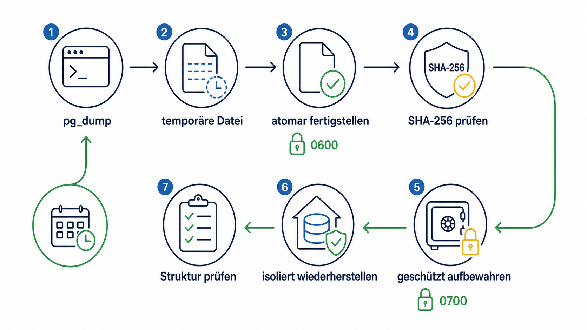
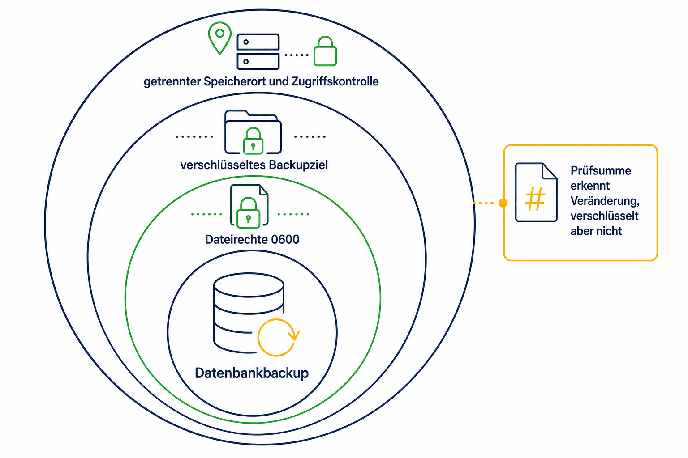
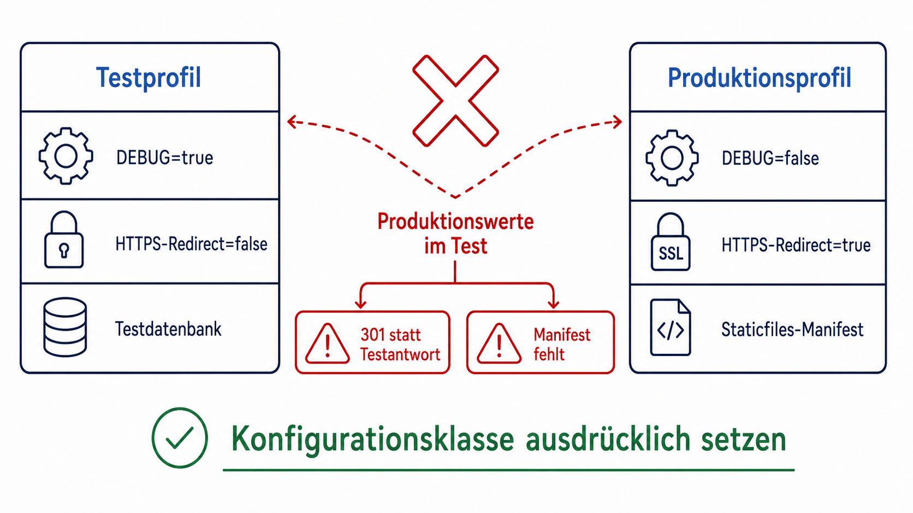

# Kapitel 7: Backups entwerfen und Wiederherstellungen beweisen

Ein persistentes Datenbank-Volume fühlt sich zunächst sicher an, ist aber kein Backup. Werden Daten versehentlich gelöscht, durch eine fehlerhafte Änderung beschädigt oder geht der Server verloren, ist auch der Inhalt dieses Volumes gefährdet. Ein belastbares Betriebskonzept braucht deshalb nicht nur eine Exportdatei, sondern eine nachweisbar funktionierende Wiederherstellung.

## Ausgangslage und Ziel

Die Anwendung lief bereits mit PostgreSQL in Docker Compose. Die Datenbank war nicht über einen Host-Port erreichbar und ihr Volume war persistent. Offen waren jedoch drei Fragen:

1. Wie entsteht ein konsistentes und geschützt abgelegtes Backup?
2. Wie wird regelmäßig geprüft, dass dieses Backup tatsächlich wiederherstellbar ist?
3. Wie lässt sich eine produktive Wiederherstellung so absichern, dass sie nicht versehentlich gestartet wird?

## Prompt

> Führe in der vereinbarten Reihenfolge fort: Veröffentliche zuerst den vorhandenen Dokumentationsstand. Implementiere anschließend PostgreSQL-Backup und -Wiederherstellung. Danach analysieren wir die anonymisierten fachlichen Unterlagen und beginnen mit der nächsten Entwicklungsphase.

Der kurze Arbeitsauftrag bezog sich auf eine zuvor gemeinsam festgelegte Reihenfolge. Für das Buch wurde er sprachlich vervollständigt; sein Umfang wurde nicht erweitert.

## Codex-Arbeitsweise

Vor der Änderung las Codex den Projektplan, prüfte Compose-Konfiguration, Umgebungsbeispiel, vorhandene Skripte, Tests und Betriebsdokumentation. Die Auswirkungen wurden eingegrenzt: Es waren keine Django-Modelle oder Migrationen betroffen. Das Hauptrisiko lag im Betrieb, denn Backups enthalten potenziell denselben Schutzbedarf wie die produktive Datenbank, und ein Restore ist destruktiv.

Die Umsetzung wurde deshalb in vier getrennte Werkzeuge zerlegt:

- Backup im PostgreSQL-Custom-Format mit atomarer Fertigstellung
- Integritäts- und Lesbarkeitsprüfung
- Restore-Test in einem isolierten, kurzlebigen Container
- produktiver Restore mit deutlicher Bestätigung und vorgeschaltetem Sicherheitsbackup

Diese Trennung macht den ungefährlichen Routinefall einfach und hält den riskanten Eingriff sichtbar.



## Wichtige Befehle

```bash
./scripts/backup-postgres.sh
./scripts/verify-postgres-backup.sh backups/postgres/BEISPIEL.dump
./scripts/test-postgres-restore.sh backups/postgres/BEISPIEL.dump
```

Der produktive Restore wird nicht als gewöhnlicher Test ausgeführt. Er benötigt einen ausdrücklich benannten Bestätigungsparameter und ein Wartungsfenster.

## Sicherheits- und Datenschutzentscheidungen

Das Skript setzt `umask 077`, das Backupverzeichnis auf Modus `0700` und die Dateien auf `0600`. Temporäre Dateien werden bei Fehlern entfernt. Eine einfache Sperre verhindert parallele Läufe. Backups und Build-Ausgaben sind von Git ausgeschlossen.

Eine SHA-256-Prüfsumme erkennt unbeabsichtigte Veränderungen, bietet aber keine Verschlüsselung und beweist allein noch keinen erfolgreichen Restore. Deshalb spielt ein eigenes Testskript das Archiv in eine isolierte PostgreSQL-Instanz ohne veröffentlichten Netzwerkport ein. Es prüft nur die Datenbankstruktur und gibt keine personenbezogenen Inhalte aus.

Die systemd-Konfiguration wurde als Repository-Vorlage dokumentiert. Codex änderte keine globale Serverkonfiguration automatisch. Betriebskonto, absoluter Zielpfad, Überwachung, Aufbewahrungsfrist und verschlüsseltes externes Sicherungsziel müssen bewusst festgelegt werden.



## Ein Testfehler, der keiner war

Beim ersten Python-Testlauf wurden versehentlich die produktiven Einstellungen aus der lokalen Umgebung übernommen. Dadurch antwortete Django mit HTTPS-Weiterleitungen, während die Tests direkte Antworten erwarteten. Nach dem Abschalten der Weiterleitung scheiterten Template-Tests noch am fehlenden Staticfiles-Manifest: Auch `DEBUG=false` war aus der Produktionskonfiguration übernommen worden.

Der erfolgreiche Lauf verwendete deshalb ausdrücklich eine lokale Testkonfiguration mit aktiviertem Debug-Modus sowie deaktivierter HTTPS-Weiterleitung und sicheren Cookies. Die produktive Konfiguration wurde nicht verändert. Die Erkenntnis ist allgemein: Ein reproduzierbarer Testlauf muss nicht nur Abhängigkeiten, sondern auch seine Konfigurationsklasse eindeutig festlegen. Ein fehlgeschlagener Test darf erst nach Prüfung von Code, Umgebung und Erwartung einer Änderung zugeschrieben werden.



## Übertragbare Erkenntnisse

Ein Backup gilt erst dann als belastbar, wenn mindestens vier Eigenschaften zusammenkommen: Es wird regelmäßig erzeugt, vor unbefugtem Zugriff geschützt, auf Integrität geprüft und testweise wiederhergestellt. Für Codex-Aufträge sollte daher nicht nur „Backup einrichten“, sondern auch „isolierten Restore-Test, Aufbewahrung, Überwachung und Rückfallweg dokumentieren“ verlangt werden.
