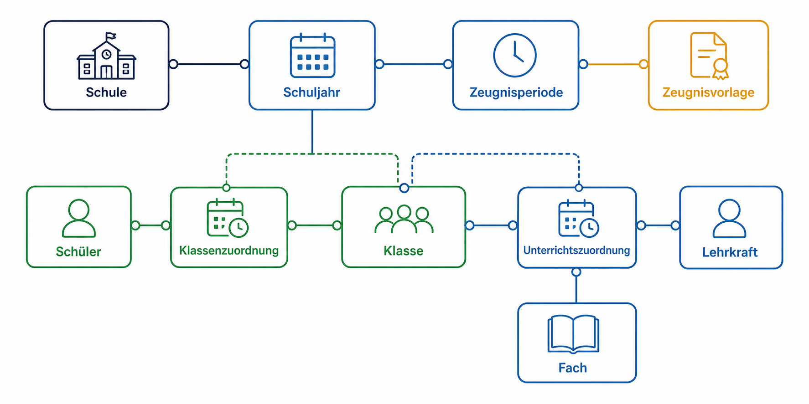
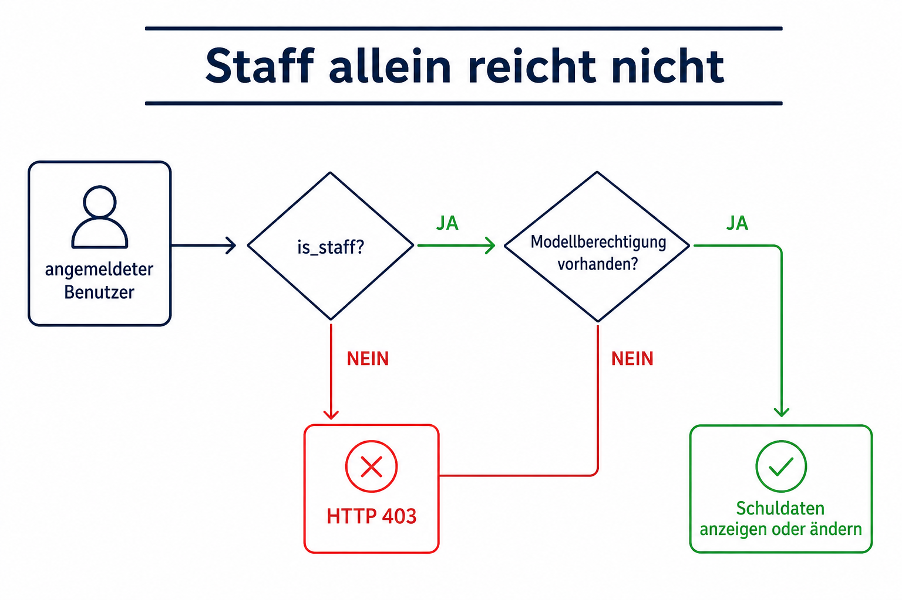
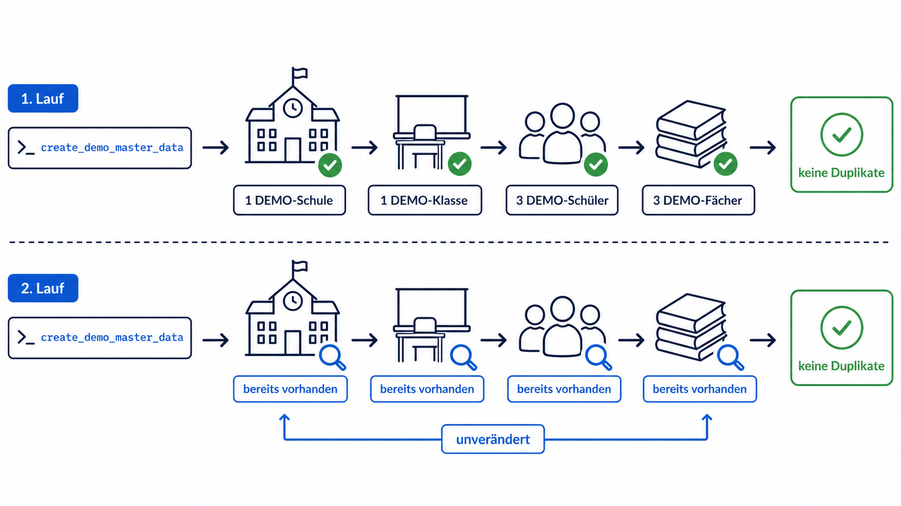
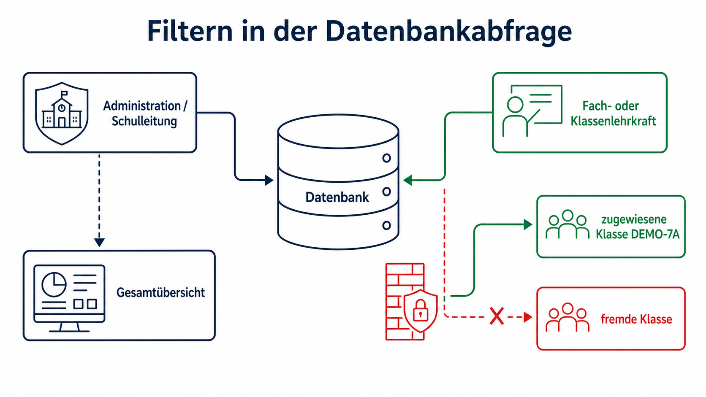

# Kapitel 8: Mit unbekannten Fachdetails sicher beginnen

Ein Softwareprojekt kann nicht immer auf vollständige Vorlagen, Tabellen und Prozessbeschreibungen warten. Gleichzeitig wäre es gefährlich, aus wenigen Annahmen sofort ein starres Datenmodell oder eine scheinbar fertige Noteneingabe zu bauen. Dieses Kapitel zeigt den gewählten Mittelweg: ein kleiner, erweiterbarer Fachkern mit klar markierten Grenzen.

## Redaktionell überarbeiteter Prompt

> Leider liegen uns noch keine Vorlagen vor, und das Datenmodell muss später möglicherweise angepasst werden. Trotzdem sollen Fächer, Schülerinnen und Schüler, Dokumentvorlagen für Zeugnisse, Noten, Lehrkräfte und alle weiteren schulischen Stammdaten eingegeben werden können. Merge zuerst Pull Request 9 und setze die Entwicklung anschließend fort.

Die Buchfassung korrigiert Sprache und Struktur, ohne die Anforderung zu erweitern. Der Wunsch nach Noteneingabe wird bewusst nicht als Freigabe für eine ungeschützte Schnelllösung verstanden.

## Entscheidung: zuerst sichere Stammdaten

Pull Request 9 wurde zunächst konfliktfrei nach `main` gemergt. Für die neue Aufgabe entstand danach ein eigener Feature-Branch. Die bestehende Architektur besaß bereits Anmeldung, PostgreSQL, ein eigenes Benutzermodell und eine geschützte Django-Administration. Deshalb wurde diese Administration als erster Eingabekanal wiederverwendet.

Der Fachkern trennt:

- Schule, Schuljahr und Zeugnisperiode
- Lehrkräfte als Benutzerkonten mit schulischer Rolle
- Fächer mit konfigurierbarem Notenbereich
- Klassen und Klassenleitungen
- Schülerstammdaten und historische Klassenzuordnungen
- Unterrichtszuordnungen pro Klasse, Fach, Lehrkraft und Periode
- versionierte Metadaten für spätere Zeugnisvorlagen

Historische Zuordnungen stehen in eigenen Tabellen. Dadurch muss ein Klassenwechsel nicht durch Überschreiben alter Schülerdaten abgebildet werden.

## Ein hilfreicher fehlgeschlagener Test

Der erste Berechtigungstest erwartete, dass jeder Benutzer mit `is_staff=True` Schuldaten öffnen könne. Django antwortete korrekt mit HTTP 403: Staff-Zugang allein verleiht noch keine Modellberechtigung. Die Anwendung wurde nicht aufgeweicht. Stattdessen wurden Test und Navigation so korrigiert, dass jede Datenart ihre ausdrücklichen Anzeige-, Anlage-, Änderungs- und Löschrechte behält.

## Warum Noten noch gesperrt bleiben

Eine einfache Notentabelle wäre schnell erstellt. Sie wäre aber fachlich und sicherheitstechnisch unvollständig. Vor einer Freischaltung müssen mindestens die zugewiesene Schule, Klasse, das Fach, die Zeugnisperiode, deren Status, die Notenskala und die letzte Datensatzversion serverseitig geprüft werden. Außerdem sind Audit-Protokoll und Konfliktmeldung erforderlich.

Die wichtige Codex-Erkenntnis lautet: Ein Auftrag darf in sichere, nutzbare Ausbaustufen zerlegt werden, wenn eine sofortige Gesamtumsetzung zentrale Schutzregeln verletzen würde. Die damals noch nicht erfüllte Anforderung blieb sichtbar und wurde in der anschließenden Demo-Phase aus Kapitel 9 kontrolliert umgesetzt.

## Kleine Beispieldaten reproduzierbar erfassen

> Erfasse bitte in kleinem Umfang Beispieldaten.

Auch dieser kurze Prompt wurde für die Buchfassung sprachlich geglättet. Statt Daten einmalig per Datenbank-Shell einzutragen, entstand ein transaktionaler und idempotenter Django-Management-Befehl. Er erzeugt eine klar als `DEMO` benannte Schule, eine Klasse, drei Schüler, drei Fächer, Zuordnungen und eine Vorlagenbeschreibung.

Die künstliche Lehrkraft ist deaktiviert und hat kein verwendbares Passwort. Kontaktadressen verwenden die reservierte Endung `.invalid`. Zwei automatische Tests beweisen, dass ein zweiter Lauf keine Duplikate erzeugt und ein vorhandenes Administratorkonto unverändert bleibt. So werden Beispieldaten zu einem wiederholbaren Teil der Anwendung statt zu einem nicht nachvollziehbaren Eingriff in die Produktionsdatenbank.

## Vom Design-Dashboard zur echten Auswertung

> Lass uns das Dashboard so weiterentwickeln, dass es tatsächlich mit den vorhandenen Daten arbeitet.

Die statischen Beispielzahlen wurden daraufhin vollständig entfernt. Ein eigener Dashboard-Selektor ermittelt Klassen, Schüler, Fächer und offene Zeugnisperioden aus der Datenbank. Dabei wird nicht nur die Darstellung, sondern bereits die Abfrage eingeschränkt: Fach- und Klassenlehrkräfte erhalten ausschließlich zugewiesene Klassen. Administration und Schulleitung sehen die Gesamtübersicht.

Besonders wichtig war der Umgang mit noch nicht vorhandenen Noten. Statt weiterhin erfundene Prozentwerte anzuzeigen, nennt die Oberfläche ehrlich die Zahl der verbundenen Stammdaten und markiert Klassen als bereit für das spätere Notenmodul. Tests prüfen sowohl die korrekte Gesamtansicht als auch den negativen Sicherheitsfall: Eine nicht zugewiesene Lehrkraft darf weder fremde Klassen- noch Schulnamen im HTML erhalten.

