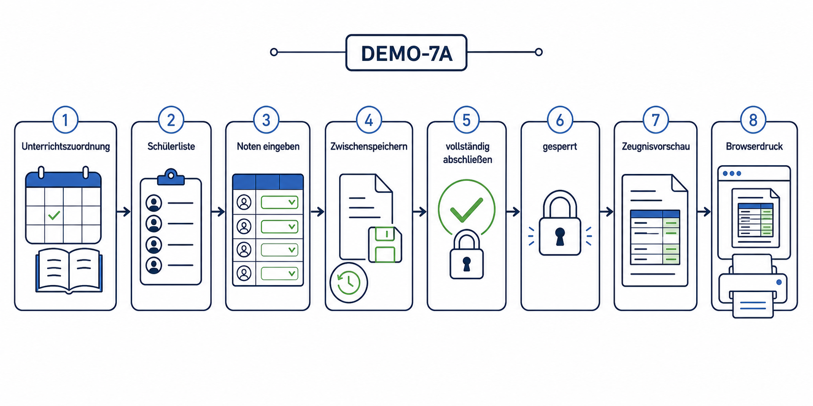
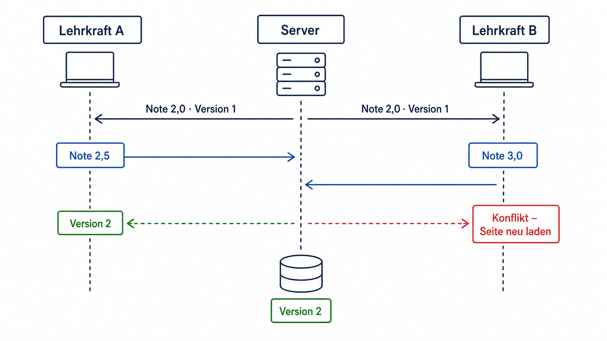
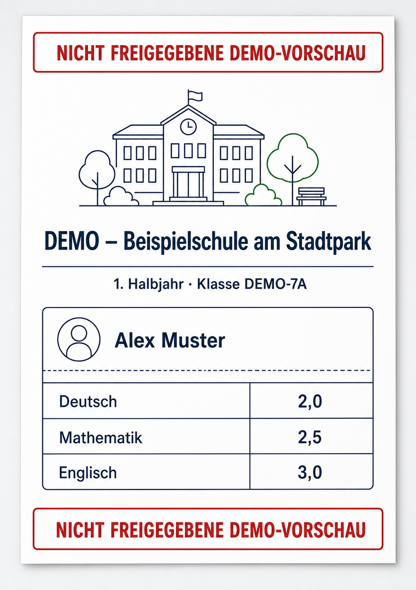

# Kapitel 9: Eine kleine Demo fachlich vollständig machen

## Redaktionell überarbeiteter Prompt

> Stelle für die kleine Demo noch drei Punkte fertig: eine echte Noteneingabe, einen einfachen Zeugnisentwurf und einen kleinen Abschluss- beziehungsweise Sperrstatus. Danach wechseln wir mit der Priorität zum Praxisbeispiel.

## Ein vertikaler Ablauf statt einzelner Masken

Die drei Anforderungen wurden als zusammenhängender Ablauf entwickelt. Eine Unterrichtszuordnung bestimmt Lehrkraft, Klasse, Fach und Zeugnisperiode. Daraus entsteht eine Noteneingabe, die alle zugeordneten Schüler enthält. Gespeicherte Noten erscheinen unmittelbar in einer einfachen druckbaren Zeugnisvorschau.

## Sicherheit trotz Demo

Eine kleine Demo ist kein Grund, kritische Schutzmechanismen auszulassen. Die Anwendung prüft Berechtigung, offene Zeugnisperiode, Notenskala und Schrittweite serverseitig. Jede Note besitzt eine Versionsnummer. Sendet ein Browser einen veralteten Stand, wird der Speichervorgang mit einem verständlichen Konflikt abgebrochen.

Der Abschluss verlangt Noten für alle Schüler und sperrt danach die Eingabe. Nur Administration kann die Sperre wieder aufheben. Speichern, Abschluss und Wiederöffnung erzeugen Audit-Ereignisse; normale Benutzer können diese nicht verändern. Direkte Änderungen über die Django-Administration wurden für Noten deaktiviert.

## Bewusste Grenze

Die Druckansicht ist eine Demo-Vorschau und wird sichtbar so bezeichnet. Sie ersetzt noch keine unveränderliche PDF-Version, Prüfsumme oder formale Freigabe. Diese klare Benennung verhindert, dass eine überzeugende Oberfläche fälschlich als fertiger Produktionsprozess verstanden wird.

