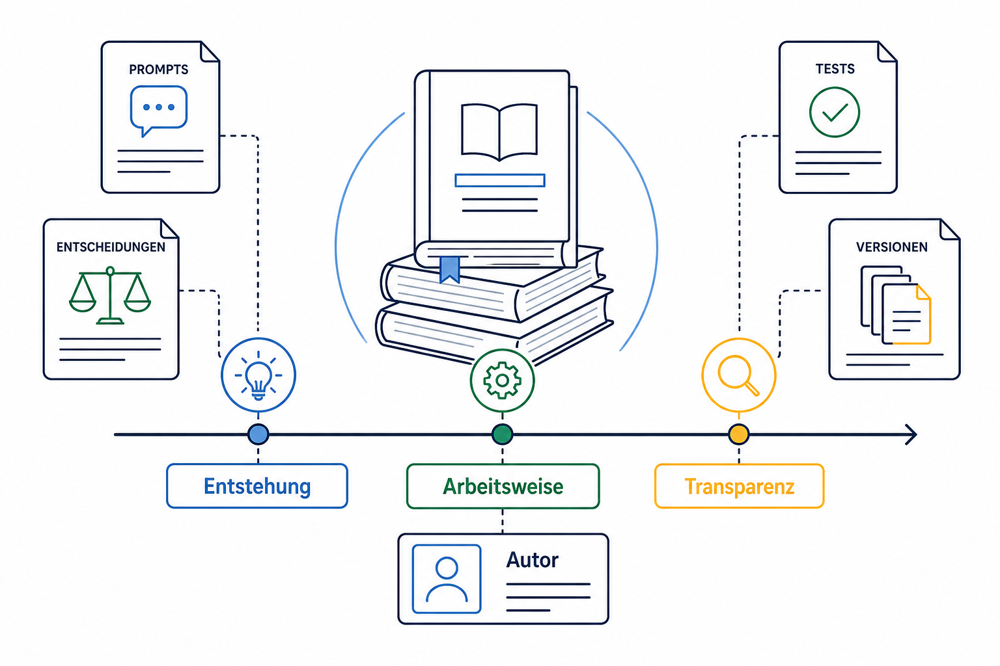

# Projektchronik und Vollständigkeitskontrolle

Diese Chronik verhindert, dass wichtige Schritte der Zusammenarbeit im Buch verloren gehen. Sie enthält keine Secrets, echten Schülerdaten oder unnötigen lokalen Systemdetails.

## Erfassungsstatus

| Abschnitt | Wesentliche Ereignisse | Dokumentiert in | Status |
|---|---|---|---|
| Projektstart | `PLAN.md`, `AGENTS.md`, Git-Repository, erster Commit | Kapitel 1 | erfasst |
| GitHub-Grundlage | zunächst privates Repository, später öffentlich, GPLv3 | Kapitel 1 | erfasst |
| Buchregeln | Prompts redaktionell überarbeiten, keine sensiblen Inhalte | Kapitel 1 und `buch/README.md` | erfasst |
| Git-Workflow | Feature-Branches, Draft-PRs, Prüfungen, Mergefreigaben | Kapitel 1 und Kommandoreferenz | erfasst |
| Serveranalyse | DNS, belegte Ports, vorhandene Container und Nginx geprüft | Kapitel 2 | erfasst |
| Django-Grundgerüst | Django 5.2 LTS, eigenes Usermodell, PostgreSQL, Gunicorn | Kapitel 2 | erfasst |
| Sicherheit | CSRF, sichere Cookies, HTTPS-Redirect, HSTS, Login-Sperre | Kapitel 2 | erfasst |
| Docker | Nicht-Root-Webcontainer, Healthchecks, Port 8005 | Kapitel 2 | erfasst |
| erster Laufzeitfehler | `collectstatic` scheiterte an Verzeichnisrechten | Kapitel 2 | erfasst |
| HTTPS | Nginx, Let's Encrypt, HTTP-Weiterleitung, Zertifikatsprüfung | Kapitel 2 | erfasst |
| Healthcheck-Korrektur | Produktivhost und Proxyprotokoll ergänzt | Kapitel 2 | erfasst |
| UI-Grundsystem | Login, Navigation, Dashboard, responsives CSS | Kapitel 3 | erfasst |
| Beispieldaten | flüchtig, künstlich, sichtbar als Demo gekennzeichnet | Kapitel 3 | erfasst |
| Staticfiles | `STATICFILES_DIRS`, WhiteNoise und Live-CSS-Prüfung | Kapitel 3 | erfasst |
| Codex-Grundlage | GPT-5.6 Sol, Oberflächen und Befehlsarten | Kapitel 4 | erfasst |
| GPT-5.6-Neuerungen | Vergleich mit GPT-5.5, neue Arbeitsweisen, Benchmarks und Praxisbeispiele | Kapitel 5 | erfasst |
| GPT-5.6-Modellwahl | Sol, Terra und Luna nach Aufgabe, Risiko, Kosten und Verfügbarkeit auswählen | Kapitel 6 | erfasst |
| Codex-Kommandos | App-, CLI-, Git-, Docker- und Django-Referenz | Kommandoreferenz | erfasst |
| EPUB-Zwischenstand | wiederholbarer Pandoc-Containerbuild, Metadaten und EPUB-CSS | `buch/README.md` und Buildskript | erfasst |
| GitHub-Buchrelease | EPUB als öffentlicher Prerelease-Download mit SHA-256-Prüfung | `buch/README.md` und Release-Notizen | erfasst |
| Datenbanksicherung | geschütztes PostgreSQL-Backup, Prüfsumme und Aufbewahrung | Kapitel 7 und Betriebsdokumentation | erfasst |
| Restore-Test | isolierte kurzlebige PostgreSQL-Instanz ohne Ausgabe von Fachdaten | Kapitel 7 und Betriebsdokumentation | erfasst |
| erster Fachkern | Stammdaten trotz fehlender Vorlagen sicher und erweiterbar beginnen | Kapitel 8 | erfasst |
| künstliche Beispieldaten | idempotenter Management-Befehl ohne anmeldbares Standardkonto | Kapitel 8 | erfasst |
| Live-Dashboard | echte Stammdatenzahlen mit rollenbezogen eingeschränkten Abfragen | Kapitel 8 | erfasst |
| Demo-Zeugnisablauf | Noteneingabe, Konfliktschutz, Abschluss, Audit und Druckvorschau | Kapitel 9 | erfasst |
| Bildkonzept | 22 fortlaufende Platzhalter und exakte Generierungsbriefings | alle Kapitel und Bildverzeichnis | erfasst |
| Buchtransparenz | Entstehung, Arbeitsweise, Transparenz und Autor | `buch/README.md` und `projektchronik.md` | erfasst |
| Fachmodelle | sichere Stammdaten und Berechtigungsgrundlage; Produktivumfang bewusst abgegrenzt | Kapitel 8 | für Show-case erfasst |
| Noten und Zeugnisse | validierte Demo-Noteneingabe, Locking, Abschluss und Druckvorschau | Kapitel 9 | für Show-case erfasst |
| Betrieb | Compose-Autostart und Betriebsgrenze; weitere Härtung nur für ein Produktivsystem | Kapitel 10 und Betriebsdokumentation | für Show-case erfasst |
| Show-case-Abschluss | Compose-Autostart, TODO-Bereinigung, Lesekonto für das Buch | Kapitel 10, `buch/README.md` und Chronik | erfasst |

## Bisherige Pull Requests

| PR | Inhalt | Ergebnis |
|---|---|---|
| #1 | öffentliche Projektregeln, README und GPLv3 | gemergt |
| #2 | Django-Grundgerüst, PostgreSQL, Docker und Tests | gemergt |
| #3 | Nginx- und HTTPS-Vorbereitung | gemergt |
| #4 | erfolgreicher HTTPS-Betrieb dokumentiert | gemergt |
| #5 | UI-Grundsystem und künstliches Demo-Dashboard | gemergt |
| #6 | Buchstruktur, GPT-5.6-Sol-Grundlage und Codex-Kommandoreferenz | gemergt |
| #7 | wiederholbarer EPUB3-Buildprozess | gemergt |
| #8 | öffentlicher EPUB-Prerelease in README und Buch dokumentiert | gemergt |
| #9 | PostgreSQL-Backup, Restore-Test und Betriebsdokumentation | gemergt |

## Prompt zum EPUB-Zwischenstand

> Merge den aktuellen Buchstand nach `main` und erstelle anschließend eine EPUB-Datei als Zwischenstand des Praxisbeispiels.

## Prompt zu Backup und Restore

> Führe in der vereinbarten Reihenfolge fort: Veröffentliche zuerst den vorhandenen Dokumentationsstand. Implementiere anschließend PostgreSQL-Backup und -Wiederherstellung. Danach analysieren wir die anonymisierten fachlichen Unterlagen und beginnen mit der nächsten Entwicklungsphase.

Die Ausarbeitung dieses Schritts steht in Kapitel 7. Ein Pull Request und sein Ergebnis werden nach Abschluss ergänzt.

## Prompt zum ersten Fachkern

> Leider liegen uns noch keine Vorlagen vor, und das Datenmodell muss später möglicherweise angepasst werden. Trotzdem sollen Fächer, Schülerinnen und Schüler, Dokumentvorlagen für Zeugnisse, Noten, Lehrkräfte und alle weiteren schulischen Stammdaten eingegeben werden können. Merge zuerst Pull Request 9 und setze die Entwicklung anschließend fort.

Die sichere Aufteilung und die noch bewusst gesperrte Noteneingabe werden in Kapitel 8 erläutert.

## Buchtransparenz und Entstehung

Die Chronik hält die Arbeitsartefakte des Praxisbeispiels sichtbar fest: Prompts, Entscheidungen, Tests, Versionen und die Überarbeitung der Dokumentation. So bleibt nachvollziehbar, wie aus der Projektarbeit ein Buch entstand.

## Wiederkehrender Abschlusscheck

Nach jeder größeren Aufgabe beantworten:

1. Ist der maßgebliche Benutzerprompt dokumentiert?
2. Sind Ausgangslage und Ziel verständlich?
3. Sind Analyse, Risiken und Entscheidung festgehalten?
4. Sind wichtige Codex-, Git-, Docker- und Testbefehle erfasst?
5. Sind Fehler und deren tatsächliche Ursachen dokumentiert?
6. Sind Datenschutz- und Sicherheitsauswirkungen beschrieben?
7. Sind Tests und Prüfergebnisse genannt?
8. Sind Commit, Branch und Pull Request nachvollziehbar?
9. Sind offene Punkte und manuelle Schritte sichtbar?
10. Enthält der Text keine echten Schülerdaten, Secrets oder sensiblen Systemdetails?

## Show-case-Abschluss und Lesekonto

Die Laufzeitumgebung startet den Docker-Compose-Stack nach einem Serverneustart nun über systemd wieder an. Damit ist der Betrieb für den Show-case robuster, ohne dass die Anwendung zu einer permanenten Ausbaufläche wird.

Parallel dazu wurde ein separates Lesekonto für das Praxisbeispiel vorbereitet. Der Benutzer heißt `Buch` und erhält nur Read-only-Rechte auf die dokumentierten Verwaltungsdaten. Das Kennwort wurde zunächst getrennt übermittelt und später ausdrücklich als öffentlicher Demo-Zugang für ausschließlich künstliche Daten freigegeben.

Die übrigen, für den Show-case nicht mehr benötigten Betriebs- und Fachpunkte wurden aus der offenen Arbeitsliste entfernt. Damit bleibt die Restarbeit bewusst klein und nachvollziehbar.

## Prompt zum Show-case-Abschluss

> Schließe den Show-case sauber ab. Der Docker-Compose-Stack soll nach einem Serverneustart automatisch wieder starten, und das Praxisbeispiel benötigt zusätzlich ein separates Lesekonto mit reinen Lese-Rechten. Alle dafür relevanten Arbeitsschritte sollen nachvollziehbar dokumentiert werden. Sensible Zugangsdaten werden nicht im Buch als Klartext gespeichert.

## Buchgrafiken im EPUB zuverlässig zentrieren

### Prompt

> Zentriere sämtliche Bilder im EPUB. Sie dürfen weder rechtsbündig erscheinen noch über den verfügbaren Seitenbereich hinausragen. Entferne diesen Punkt nach erfolgreicher Umsetzung aus der offenen Aufgabenliste.

### Entscheidung und Prüfung

Die Grafiken werden zentral über das EPUB-Stylesheet formatiert. Bilder und das von Pandoc erzeugte Cover-SVG sind Blockelemente mit automatischen linken und rechten Rändern. Eine maximale Breite von 100 Prozent verhindert Überbreite; eine automatische Höhe bewahrt das Seitenverhältnis. Auch die umgebenden `figure`-Elemente und Bildunterschriften sind zentriert, damit abweichende Standardstile einzelner EPUB-Reader die Ausrichtung nicht unbemerkt verändern.

Ein automatisierter Layouttest schützt die maßgeblichen CSS-Regeln. Nach dem Neubau wurde zusätzlich direkt im EPUB-Archiv geprüft, dass das Stylesheet eingebettet ist, alle Buchgrafiken enthalten sind und Pandoc das Titelbild mit mittiger SVG-Ausrichtung erzeugt.

## Überbreite Codeblöcke im EPUB verhindern

### Prompt

> Überarbeite die Darstellung aller Codeblöcke so, dass lange Befehle, Pfade und andere nicht trennbare Zeichenfolgen bei keiner unterstützten Zoomstufe über den Seitenrand laufen. Entferne diesen Punkt nach erfolgreicher Umsetzung aus der offenen Aufgabenliste.

### Entscheidung und Prüfung

Die Markdown-Quellen bleiben unverändert, damit kopierbare Befehle nicht durch manuell eingefügte Trennzeichen verfälscht werden. Stattdessen begrenzt das zentrale EPUB-Stylesheet jeden Codeblock einschließlich Rahmen und Innenabstand auf die verfügbare Seitenbreite. Lange Zeichenfolgen dürfen an jeder erforderlichen Stelle umbrechen. Eigene Regeln berücksichtigen Inline-Code, Codeblöcke sowie Code innerhalb von Tabellen.

Ein automatisierter Layouttest prüft Seitenbegrenzung, Umbruch und die Vererbung der Regeln. Nach dem EPUB-Build wird zusätzlich kontrolliert, dass Pandoc die Regeln vollständig in das Buch eingebettet hat.

## Tabellen für schmale Seiten und hohe Zoomstufen absichern

### Prompt

> Überarbeite die Tabellen in der Projektchronik und der Vollständigkeitskontrolle so, dass sie nicht über den Seitenrand hinausragen. Verwende eine kleinere, weiterhin lesbare Schrift und sichere auch lange Begriffe gegen Überbreite ab. Entferne den Punkt nach erfolgreicher Prüfung aus der Aufgabenliste.

### Entscheidung und Prüfung

Das Manuskript enthält Tabellen mit zwei bis sechs Spalten. Die Tabellen bleiben erhalten, weil ihre direkte Gegenüberstellung einen höheren Nutzwert als getrennte Listen besitzt. Das EPUB-Stylesheet begrenzt sie einschließlich Rahmen und Innenabständen auf die Seitenbreite, verwendet ein festes Spaltenlayout und verkleinert die Tabellenschrift auf 74 Prozent der Grundschrift. Zellen erhalten kompakte Abstände, automatische Silbentrennung und sichere Umbrüche für lange Wörter und Codebegriffe.

Automatische Tests prüfen die maßgeblichen CSS-Regeln, eine einheitliche Spaltenzahl je Tabelle und die festgelegte Obergrenze von sechs Spalten. Nach dem Build wird das tatsächlich in das EPUB eingebettete Stylesheet zusätzlich kontrolliert.

## Einheitliches Drucklayout für das gesamte EPUB

### Prompt

> Vereinheitliche jetzt das Drucklayout des gesamten Buchs. Prüfe Überschriften, Abstände, Seitenumbrüche, Bildunterschriften, Listen, Zitate, Tabellen und Codeblöcke. Entferne den Punkt nach erfolgreicher Umsetzung aus der Aufgabenliste.

### Entscheidung und Prüfung

Alle zehn Kapitel sowie Bildverzeichnis, Kommandoreferenz und Projektchronik verwenden eine durchgängige Überschriftenhierarchie von H1 bis H3. Das zentrale EPUB-Stylesheet definiert nun einen einheitlichen Satzspiegel, feste Größen und Abstände für Überschriften, konsistente Absätze und Listen sowie abgestimmte Darstellungen für Zitate, Abbildungen, Bildunterschriften, Codeblöcke und Tabellen.

Um verwaiste Überschriften zu vermeiden, werden Überschriften nicht vom folgenden Inhalt getrennt. Abbildungen und kurze Codeblöcke bleiben nach Möglichkeit zusammen. Absatzzeilen erhalten einheitliche Regeln für Schusterjungen und Hurenkinder. Das Cover behält einen eigenen randlosen Satzspiegel. Automatische Tests prüfen Hierarchie und zentrale Layoutregeln; anschließend wird das eingebettete Stylesheet im neu gebauten EPUB kontrolliert.

## Bewusster Verzicht auf zusätzliche Screenshots

### Prompt

> Entferne den offenen Screenshot-Punkt. Zusätzliche Bildschirmaufnahmen wären redundant, weil das Projekt direkt aufgerufen werden kann und das Buch bereits über ein vollständiges, einheitliches Bildkonzept verfügt.

### Entscheidung

Das Buch erhält keine zusätzlichen Screenshots der Weboberfläche. Die vorhandenen 22 Buchgrafiken erklären Architektur, Abläufe, Sicherheit und Bedienkonzepte in einem einheitlichen Stil. Die öffentlich erreichbare Demonstration ermöglicht darüber hinaus einen direkten Eindruck von der aktuellen Oberfläche. Zusätzliche Screenshots würden Inhalte doppeln, schneller veralten und eine weitere Datenschutzprüfung erfordern.

Sollte eine spätere Buchauflage dennoch Screenshots verwenden, gelten weiterhin die unveränderten Schutzregeln: ausschließlich künstliche Daten, keine Passwörter oder Tokens und keine sensiblen lokalen Systemdetails.

## Zentrales Quellenverzeichnis statt separatem Versionskatalog

### Prompt

> Lege ein zentrales Quellenverzeichnis an und entferne diesen Punkt anschließend aus der Aufgabenliste. Ein zusätzlicher vollständiger Versionskatalog erscheint für das Praxisbeispiel nicht nützlich und soll ebenfalls aus der offenen Liste gestrichen werden.

### Entscheidung und Prüfung

Das Quellenverzeichnis trennt zeitabhängige OpenAI- und Codex-Informationen, technische Primärdokumentation und interne Projektquellen. Externe Einträge nennen Herausgeber, Titel, URL, Abrufdatum und ihre Verwendung im Buch. Die Links wurden vor der Aufnahme auf öffentliche Erreichbarkeit geprüft. Kapitelnahe Quellen bleiben bestehen, damit wichtige Aussagen weiterhin direkt belegt sind.

Auf eine zusätzliche Tabelle sämtlicher Programm- und Betriebsversionen wird bewusst verzichtet. Sie würde schnell veralten und einen Pflegeaufwand erzeugen, der für die didaktische Aussage des Show-cases keinen entsprechenden Nutzen bietet. Reproduktionsrelevante Versionen bleiben in den tatsächlichen Artefakten erhalten, beispielsweise im `Dockerfile`, in den Requirements-Dateien und im fest versionierten EPUB-Buildskript. Zeitabhängige Aussagen nennen weiterhin ihren konkreten Redaktions- oder Abrufstand.

## Glossar für Projekt- und Codex-Begriffe

### Prompt

> Erstelle jetzt das Glossar des Buchs. Erkläre die zentralen Begriffe verständlich und konsistent mit den Kapiteln und der Codex-Kommandoreferenz. Entferne den Punkt nach erfolgreicher Umsetzung aus der Aufgabenliste.

### Entscheidung und Prüfung

Das alphabetische Glossar erklärt neben Prompt, Kontext, Skill, Plugin, MCP, Sandbox, Migration und Pull Request weitere häufig verwendete Begriffe aus Codex-Arbeit, Git, Django, Sicherheit, Docker und EPUB. Die Definitionen sind bewusst projektbezogen: Sie erläutern nicht nur die allgemeine Bedeutung, sondern auch die Rolle des jeweiligen Begriffs in der Fallstudie.

Ein automatisierter Test stellt sicher, dass alle verpflichtenden Begriffe vorhanden sind und das Glossar in den EPUB-Build einfließt. Überschriftenhierarchie und Archivinhalt werden gemeinsam mit den übrigen Buchprüfungen kontrolliert.

## Neuer Buchtitel und erneuertes Titelbild

### Prompt

> Ändere den Buchtitel in „Arbeiten mit OpenAI Codex“ und den Untertitel in „Praxisbeispiel am Beispiel einer schulischen Zeugnisverwaltung“. Erneuere außerdem das Titelbild und passe alle relevanten Stellen an.

### Entscheidung und Prüfung

Der neue Titel benennt OpenAI Codex eindeutig, ohne eine konkrete Modellversion in den Haupttitel aufzunehmen. GPT-5.6 Sol bleibt als dokumentierte Arbeitsgrundlage in den Fachkapiteln erhalten. Der gewünschte Untertitel wird in Metadaten, Buchbeschreibung, Vorschauseite und Cover einheitlich verwendet. Der offensichtliche Schreibfehler „Zeignisverwaltung“ wurde für die druckbare Fassung zu „Zeugnisverwaltung“ korrigiert.

Das bestehende Monoline-Cover bleibt gestalterische Grundlage. Schul-, Dokument-, Sicherheits- und Diagrammsymbole, roter GPLv3-Hinweis sowie der Autorenname bleiben erhalten; nur Titel und Untertitel werden ausgetauscht. Der Autorenname „Ralf W. Balz“ wird zusätzlich in den EPUB-Metadaten vereinheitlicht. Automatische Tests prüfen die Übereinstimmung der textlichen Fundstellen, bevor Titelbild und EPUB neu erzeugt werden.

Die sichtbare Datumszeile der automatisch erzeugten EPUB-Titelseite wird als „2026 - Juli“ ausgegeben. Das maschinenlesbare EPUB-Metadatenfeld verwendet gleichzeitig den gültigen Wert `2026-07`. Detaillierte Veröffentlichungs- und Abrufdaten in den Fachkapiteln und im Quellenverzeichnis bleiben davon unberührt.

## Schlussredaktion und Freigabeprüfung

### Prompt

> Prüfe das gesamte Buch noch einmal vollständig, erzeuge anschließend das EPUB neu und lösche die abgeschlossene Aufgabenliste.

### Ergebnis

Die Schlussredaktion umfasste alle zehn Kapitel, den Autorenabschnitt, das Bildverzeichnis, die Codex-Kommandoreferenz, das Glossar, das Quellenverzeichnis und die Projektchronik. Titel, Untertitel, Autor, sichtbares Datum, Kapitelnummerierung, Build-Reihenfolge, Überschriftenhierarchie, lokale Verweise, Bilder, Tabellen, Codeblöcke und Datenschutzgrenzen wurden gemeinsam geprüft.

Der Autorenabschnitt wurde in den EPUB-Build aufgenommen und auf „Ralf W. Balz“ vereinheitlicht. Historische offene Punkte in der Chronik wurden entsprechend der bereits beschlossenen Show-case-Grenze eingeordnet. Die Buchbeschreibung unterscheidet nun klar zwischen fertigen Grafiken, abgeschlossenem Show-case und zusätzlichen Anforderungen eines echten Produktivsystems.

Nach erfolgreicher automatisierter Prüfung wurde die leere Arbeitsliste `TODO.md` gelöscht. Neue Bucharbeit gilt damit nicht als stillschweigend geplant; sie benötigt einen neuen ausdrücklichen Auftrag.

## Passwortschutz des Lesekontos

### Prompt

> Das Lesekonto `Buch` kann derzeit sein eigenes Passwort ändern. Sperre diese
> Möglichkeit serverseitig, ohne die reine Leseberechtigung oder den Zugang zur
> Verwaltung zu beeinträchtigen.

### Entscheidung und Prüfung

Das Konto bleibt ein Staff-Benutzer, weil Django diesen Status für den Zugang
zu den geschützten Verwaltungslisten verlangt. Mitglieder der verwalteten
Read-only-Gruppe dürfen die persönliche Passwortänderung jedoch nicht mehr
aufrufen; der Link wird zusätzlich in der Adminoberfläche ausgeblendet. Eine
Passwortrotation bleibt über den administrativen Management-Befehl möglich.
Tests prüfen die Sperre für das Lesekonto und den weiterhin erlaubten Weg für
Administratoren.

## Fremde Projektadressen aus der Buchfassung entfernen

### Prompt

> Entferne konkrete Adressen fremder Projekte aus dem Buch. Diese Systeme
> unterliegen eigenen hohen Datenschutzanforderungen und gehören nicht zur
> veröffentlichten Fallstudie.

### Entscheidung und Prüfung

Die technische Begründung für ein eigenes TLS-Zertifikat bleibt erhalten,
nennt aber keine Adresse einer anderen Anwendung mehr. Nach dem Neubau wird
auch der Inhalt des EPUB-Archivs geprüft, damit die entfernte Angabe weder im
Manuskript noch im veröffentlichten E-Book zurückbleibt.

## Projektzugang, Repository und paginierte Codeblöcke

### Prompt

> Arbeite alle offenen Punkte der Buchliste ab. Ergänze Projektadresse,
> Lesekonto, die Abgrenzung zwischen öffentlichem Show-case und produktivem
> Schulnetz-/VPN-Betrieb sowie das öffentliche GitHub-Repository
> mit Lizenz- und Datenschutzinformationen. Behebe außerdem den in der
> EPUB-Ansicht über die Seitengrenze laufenden Codeblock und prüfe die neue
> Fassung vollständig.

### Entscheidung und Prüfung

Das Buch trennt nun drei Zugangswege eindeutig: die Anwendung für künstliche
Show-case-Daten, das öffentliche Repository für Quellen und Mitarbeit sowie den
direkten EPUB-Download für die Buchprüfung. Das Lesekonto wird mit Benutzername
und Rechten beschrieben. Sein Kennwort wurde später ausdrücklich für den
öffentlichen, ausschließlich künstlichen Show-case freigegeben.

Der frühe mehrzeilige Git-Codeblock war durch `page-break-inside: avoid` als
unteilbares Element markiert. Einige paginierende Reader konnten ihn am
Seitenende deshalb nicht sauber umbrechen. Codeblöcke dürfen nun zwischen
Zeilen auf eine Folgeseite wechseln. Lange Inhalte und die von Pandoc erzeugten
Syntax-Highlighting-Elemente erhalten zusätzlich robuste Wort- und
Zeichenumbrüche. Automatische Tests prüfen Manuskript, CSS und erzeugte
EPUB-Struktur; die Prüffassung wird anschließend neu veröffentlicht.

## Kein Selbstverweis auf den EPUB-Download

### Prompt

> Entferne den direkten Download-Link des E-Books aus dem Buch. Die Datei darf
> weiterhin außerhalb des Buchtexts bereitgestellt werden, soll aber innerhalb
> der EPUB-Fassung nicht auf sich selbst verweisen.

### Entscheidung und Prüfung

Die Buchquellen nennen weiterhin den Unterschied zwischen Repository und
veröffentlichter Prüffassung, enthalten aber keine direkte Download-Adresse
des E-Books mehr. Ein Regressionstest durchsucht sämtliche Markdown-Dateien im
Buchverzeichnis nach dem ausgeschlossenen Downloadpfad. Nach dem Neubau wird
zusätzlich das tatsächlich erzeugte EPUB-Archiv geprüft.

## Einheitliche Einordnung als Praxisbeispiel

### Prompt

> Verwende im gesamten Buch konsequent die Bezeichnung „Praxisbeispiel“. Das
> Werk dokumentiert die konkrete Entwicklung der schulischen
> Zeugnisverwaltung und soll nicht mit einer abweichenden Buchgattung
> bezeichnet werden.

### Entscheidung und Prüfung

Einzelne historische und redaktionelle Formulierungen wurden kontextgerecht zu
„Praxisbeispiel“, „Buch“ oder „Buchprojekt“ geändert. Titel und Untertitel
bleiben davon unberührt, weil sie die gewünschte Einordnung bereits korrekt
enthalten. Ein Regressionstest prüft sämtliche Markdown-Quellen und die
EPUB-Metadaten auf eine einheitliche Bezeichnung.

## Vorwort zu Grundlagen und Voraussetzungen

### Prompt

> Ergänze ein Vorwort, das die wichtigsten Grundlagen kurz erklärt und die
> erwarteten Vorkenntnisse offen benennt. Stelle zugleich klar, dass das Buch
> keine vollständige Einführung in Linux, PuTTY, Webserver, Codex oder andere
> verwendete Werkzeuge bietet. Fehlendes Grundlagenwissen kann mit Fleiß über
> Dokumentationen, Internetsuche oder KI-Unterstützung nachgearbeitet werden.

### Entscheidung und Prüfung

Das Vorwort steht unnummeriert vor Kapitel 1. Es erklärt Prompt, Kontext,
Projektregeln, Git, Tests und Docker Compose in knapper Form. Danach grenzt es
die Fallstudie von vollständigen Werkzeugschulungen ab, nennt hilfreiche
Vorkenntnisse und ermutigt zur gezielten Eigenrecherche. Eine eigene
Sicherheitswarnung erinnert daran, KI-generierte Befehle zu prüfen und keine
Secrets oder personenbezogenen Daten in Anfragen zu übernehmen.

Automatische Tests sichern Inhalt, Überschriftenstruktur und Position in der
EPUB-Build-Reihenfolge. Nach dem Neubau wird zusätzlich kontrolliert, dass das
Vorwort im Inhaltsverzeichnis vor Kapitel 1 erscheint.

## Öffentlicher Zugangskasten für die Demo

### Prompt

> Ergänze unmittelbar nach der Überschrift von Kapitel 10 einen gut sichtbaren
> Kasten mit URL, Benutzername und Passwort der im Internet erreichbaren Demo.
> Leserinnen und Leser sollen den Show-case ohne getrennte Übermittlung öffnen
> können.

### Entscheidung und Prüfung

Der Zugang wird bewusst als öffentliches Read-only-Demokonto für ausschließlich
künstliche Daten eingestuft. Diese Entscheidung ersetzt die frühere getrennte
Kennwortübermittlung. Der Kasten nennt URL, Benutzername und Kennwort, erklärt
die fehlenden Schreibrechte und bleibt im EPUB als Einheit zusammen.

Die Ausnahme ist eng begrenzt: Produktive Zugangsdaten und echte Schuldaten
bleiben verboten. Für ein reales Schulsystem gelten weiterhin individuelle
Konten sowie Schulnetz- beziehungsweise VPN-Zugriff. Tests prüfen Inhalt,
Position und Gestaltung des Kastens sowie die unveränderten serverseitigen
Schreib- und Passwortsperren.

## Kurze Überschriften für Prompts und Arbeitsaufträge

### Prompt

> Ersetze die wiederkehrenden ausführlichen redaktionellen Zusätze in den
> Überschriften durch die kurzen Bezeichnungen „Arbeitsauftrag“ beziehungsweise
> „Prompt“. Der einmalige redaktionelle Hinweis am Anfang des Buchs genügt.

### Entscheidung und Prüfung

Die ausführliche Kennzeichnung wird nicht mehr in jedem Kapitel und jedem
Chronikeintrag wiederholt. Das Vorwort erklärt einmalig, dass alle als „Prompt“
oder „Arbeitsauftrag“ bezeichneten Abschnitte sprachlich für die Buchfassung
bearbeitet wurden, ohne ihre Absicht zu verändern. Ein Test prüft sämtliche
Markdown-Überschriften und verhindert die erneute Verwendung der langen Form.

## Veröffentlichungsinformation als PDF

### Arbeitsauftrag

> Erstelle eine PDF für die Veröffentlichung mit Titel, Untertitel,
> Autorenname und Buchbeschreibung und stelle sie über die Projektwebsite zum
> Herunterladen bereit.

### Umsetzung und Prüfung

Die Veröffentlichungsinformation wird aus einer eigenen Textquelle im
Buchverzeichnis als einseitiges A4-Dokument erzeugt. Der Download enthält keine
Demo-Zugangsdaten oder sensiblen lokalen Angaben. Automatische Tests prüfen den
öffentlichen Endpunkt, den Dateityp und den vorgeschlagenen Dateinamen.
